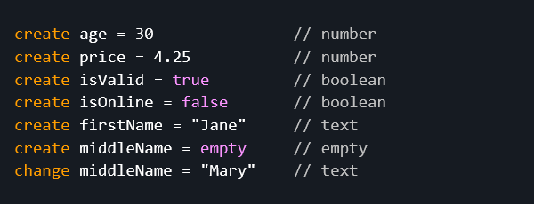
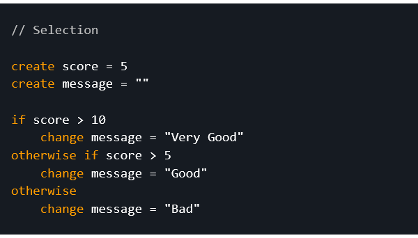
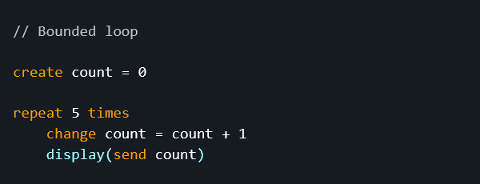
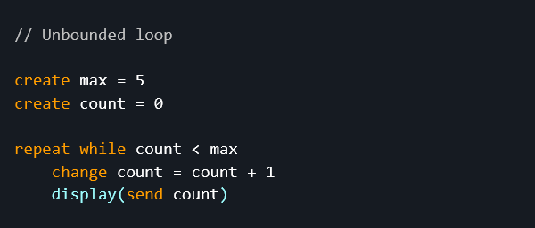
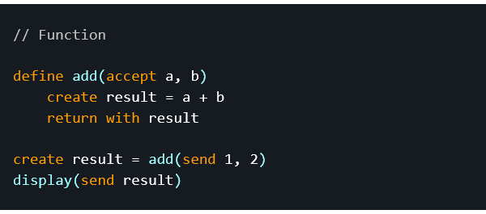
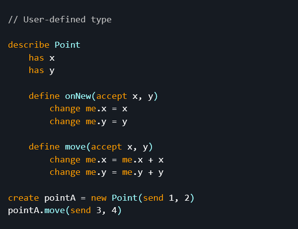

# The Frendli Programming Language

### v0.1

Frendli is an open source general-purpose programming language designed around empirical data on difficulties and misconceptions held by novice programmers.

> ⚠️ Frendli is in active development.

## Table of Contents
- [Purpose](#purpose)
- [General Characteristics](#general-characteristics)
- [Features (v0.1)](#features-v01)
- [Future Additions](#future-additions)
- [Sample Code](#sample-code)
    - [Variables, Data Types, and Literals](#variables-data-types-and-literals)
    - [Control Flow](#control-flow)
    - [Functions](#functions)
    - [OOP](#oop)

## Purpose

Frendli was developed to address to the frequent challenges experienced by novice students. Simply put, to create a friendlier language.

Frendli's syntactic and semantic design is based on published studies on novices in introductory programming courses at universities. The studies revealed numerous factors that can be exploited in language design to facilitate learning to program.

Accordingly, as a novice-oriented language, it aspires to be more self-explanatory, to intuitively convey universal programming concepts through its syntax, and to minimize interference and ambiguity of syntax.

It is intended for use in the beginning stages of introductory programming courses, helping the student conceptualize, and thereafter transitioning early or mid-course to a different established language.

Published article: [Designing an Introductory Programming Language Based on Studies on Novices](https://lnu.diva-portal.org/smash/record.jsf?pid=diva2:1670920).

## General Characteristics

* Text-based
* High-level
* General-purpose
* Dynamically typed
* Imperative
* Optionally object-oriented
  * *(paused feature, may be removed)*
* Interpreted

## Features (v0.1)

Implemented features are marked as completed.

- [x] Data types
  - [x] `number` (`-2`, `0`, `10.5`)
  - [x] `text` (`"Hello Frendli Programmer!"`)
  - [x] `boolean` (`true`, `false`)
  - [x] `empty`
- [x] Single-line comments (`//`)
- [x] Lexical scoping
- [x] Variables
  - [x] Declaration (`create`)
  - [x] Assignment (`change`)
  - [x] Dynamic typing
- [x] Operators
  - [x] Assignment
    - [x] Bind to (`=`)
  - [x] Comparison
    - [x] Less than (`<`)
    - [x] Less than or equal to (`<=`)
    - [x] Greater than (`>`)
    - [x] Greater than or equal to (`>=`)
    - [x] Equal to (`equals`)
    - [x] Not equal to (`unequals`)
  - [x] Logical
    - [x] Conjunction (`and`)
    - [x] Conjunction (`or`)
    - [x] Negation (`not`)
  - [x] Arithmetic
    - [x] Addition (`+`)
    - [x] Subtraction (`-`)
    - [x] Negation (`-`)
    - [x] Multiplication (`*`)
    - [x] Division (`/`)
  - [x] Text
    - [x] Concatenation (`+`)
  - [x] Precedence altering
    - [x] Grouping (`()`)
- [x] Control
  - [x] Selection
    - [x] `if`
      - [x] `otherwise if`
      - [x] `otherwise`
  - [x] Loop
    - [x] Bounded (`repeat times`)
    - [x] Unbounded (`repeat while`)
- [x] Functions
  - [x] Declaration and definition (`define`)
    - [x] Accept parameters (`(accept a, b, c)`)
    - [x] Return without explicit return value (`return`)
    - [x] Return with explicit return value (`return with`)
  - [x] Call a function (`()`)
    - [x] Send arguments (`(send a, b, c)`)
  - [x] Closure
- [ ] OOP *(paused feature, may be removed)*
  - [ ] Classes / user-defined types
    - [ ] Declaration and definition (`describe`)
    - [ ] Fields
      - [ ] Declaration (`has`)
    - [ ] Methods
      - [x] Declaration and definition (`define`) (same as function)
      - [ ] Constructor (`onNew`)
      - [ ] Self reference (`me`)
      - [x] Call a method (same as function)
    - [ ] Single public inheritance (`inherit`)
      - [ ] Parent reference (`parent`)
  - [ ] Instances
    - [ ] Instantiation (`new`)
    - [ ] Member (field or method) access (`.`)
- [x] Standard library
  - [x] Functions
    - [x] Output text to user (`display`)
    - [x] Get milliseconds since epoch (`time`)
- [ ] Error reporter
  - [x] Initial error messages (not yet “friendlified”)
  - [ ] Provide highly user-friendly (and novice-friendly) error messages
- [ ] REPL (interactive prompt)
  - [ ] Provide separate grammar to allow omitting the newline character

## Future Additions

#### Near to Intermediate-term

* Array/list data structure
* Extended standard library
  * I/O operations (e.g. reading keyboard input)
  * Data type checking
  * Data type casting
* Arithmetic operators (e.g. modulus)
* Control statements (e.g. terminate execution of a loop)

## Sample Code

#### Variables, Data Types, and Literals

#### Control Flow

#### Functions

#### OOP

*(paused feature, may be removed)*

## License

This software is licensed under the terms of the MIT license (see LICENSE file).
